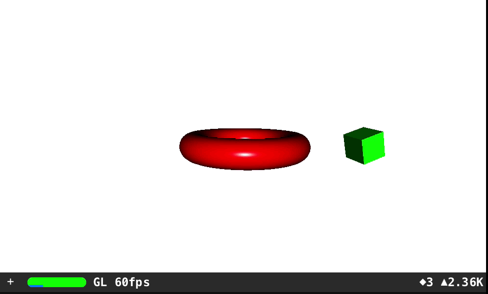
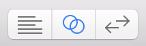

# SceneKit Playground

Basic demonstration of SceneKit with objects and animations

## Running locally

1. `git clone https://github.com/p13i/SceneKit-Playground.git`
2. `cd SceneKit-Playground`
3. Double-click on `SceneKit.playground` to open the Playground in Xcode
4. Select the Live View option in Xcode:

    

---

Pramod Kotipalli
